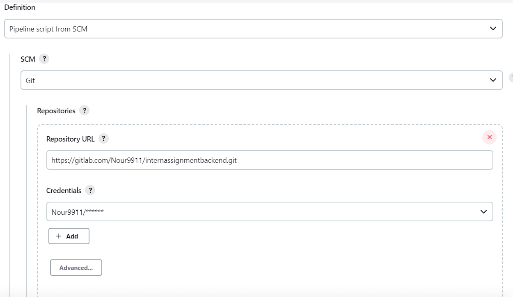
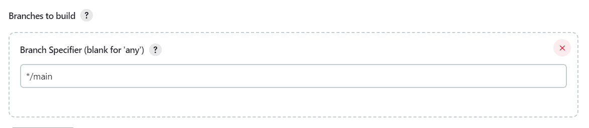
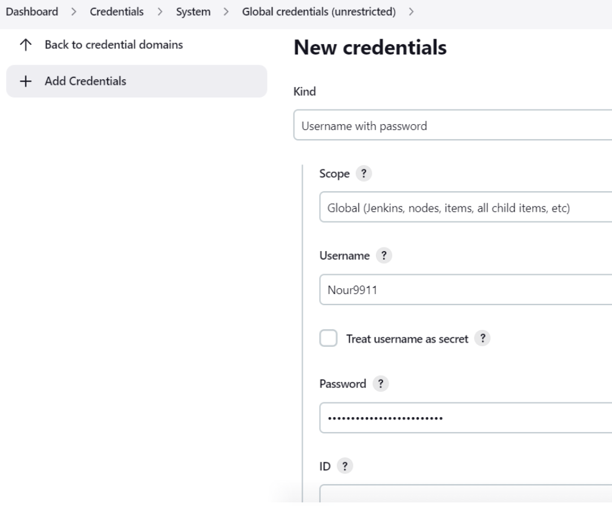
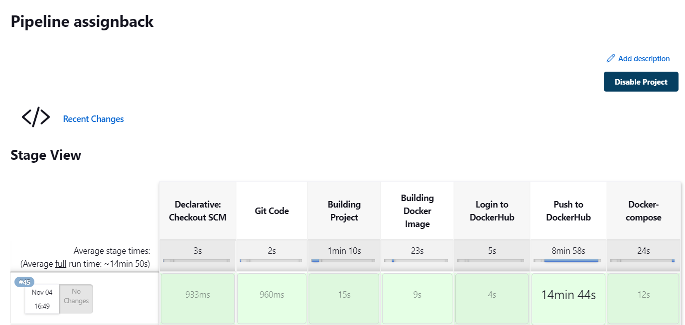
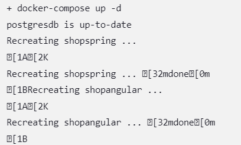

# AssignmentDEVOPS 

#### Made by:

- Nour MRAD


#### Requirements:
```
Postgres 15.0 (BD: assignmentBD)
STS (Spring Tools Suite) for the backend java application
NodeJS
Webstorm, Intellij (or others) for the frontend angular application

```
#### Notes for the backend:

Step 0 : If we are planning to run the backend application on our host pc without the deployment part then we must create manually a database named " assignmentBD " on postgres 

Step 1 : Run the springboot application so it will generate all the tables and their constraints in the database

Step 2 : I used Jenkins for the pipeline continuous integration part, thanks to our Jenkinsfile it will automatically build, test and deploy our applications automatically

 - Create a new pipeline

- Go to the piepeline conguration and make sure that you insert your gitlab url and branch (if you can't run gitlab projects on Jenkins you have to generate a token access in your gitlab profile then put it in jenkins's credential configuration)






Kind : Username with password ( because we are using a token and not ssh)

Username : gitlab username

password : your token

 - Build your pipeline and it will create a backend image, push it in my dockerhub account and deploy the services with our docker-compose.yml






[Backend with Spring BOOT Java](https://gitlab.com/Nour9911/internassignmentbackend.git
).

[Frontend with Angular JS](https://gitlab.com/Nour9911/internassignmentfrontend.git
).


